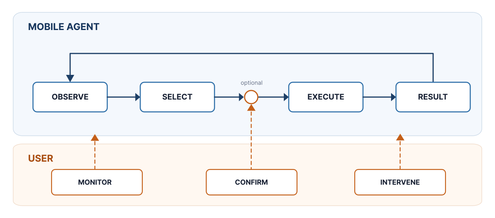

<p align="center">
  
</p>

# Caddie

Caddie is an Android research prototype for visible, interruptible smartphone
automation. The Android app owns the agent loop, observes and acts through the
Accessibility API, shows ongoing work in an overlay, and asks for confirmation
before consequential actions. Model inference is supplied by a separately
operated, OpenAI-compatible streaming endpoint.

> [!IMPORTANT]
> Caddie can read screen content and operate other apps after Accessibility is
> enabled. Treat every model as untrusted, supervise runs, and do not use Caddie
> for emergencies or unattended high-stakes tasks.



## What is included

- one Android app module in `app/`, with normal use as the default release path;
- semantic UI observation and action execution without an ADB-controlled agent
  loop;
- an on-device context engine with a Git-LFS-managed embedding model;
- visible status, interruption, correction, and confirmation surfaces;
- optional discovery and use of external MCP tools; and
- the study fixtures and evaluation records needed to inspect the thesis work,
  kept under `research/` and separate from normal use.

The repository does **not** include or operate a generative model backend.
Caddie is therefore not a fully offline or fully on-device AI system.

## Quick start

Requirements: Git LFS, JDK 21, Android SDK 36, ADB, and an Android 16 (API 36)
device or emulator.

```powershell
git clone https://github.com/cruv3/caddie.git
cd caddie
git lfs install
git lfs pull
./gradlew.bat :app:assembleNormalDebug
adb install -r app/build/outputs/apk/normal/debug/app-normal-debug.apk
```

On macOS or Linux, use `./gradlew` instead of `./gradlew.bat`. Then configure a
compatible model endpoint in Caddie, grant only the permissions you intend to
use, enable the Caddie Accessibility service, and submit a small reversible
task. The complete walkthrough is in [Getting started](docs/getting-started.md).

The PowerShell helper `scripts/install-caddie-debug.ps1` builds and installs
only Caddie, preserves app data, and verifies the development permissions. It
does not install the study fixture apps. A matching Bash helper is available at
`scripts/install-caddie-debug.sh`.

## Repository layout

- `app/` contains the Android runtime and tests.
- `docs/` contains the setup, architecture, backend, privacy, and study guides.
- `research/` contains synthetic study fixtures, study materials, and retained
  historical evaluation data. None of it is required for normal mode.
- `scripts/` contains the normal and study installation helpers.

## Documentation

| Guide | Purpose |
|---|---|
| [GitHub wiki](https://github.com/cruv3/caddie/wiki) | Project overview, setup, and study replication |
| [Documentation hub](docs/README.md) | All maintained public guides |
| [Getting started](docs/getting-started.md) | Clone, build, install, and configure |
| [First normal-mode run](docs/normal-mode.md) | Run and supervise a safe first task |
| [Model backend](docs/model-backend.md) | Required HTTP and streaming contract |
| [Architecture](docs/architecture.md) | Runtime ownership and trust boundaries |
| [Privacy and security](docs/privacy-security.md) | Data flow and safe deployment |
| [Personal memory](docs/personal-memory.md) | Encrypted notes and proposal review |
| [Troubleshooting](docs/troubleshooting.md) | Common build, connection, and UI issues |
| [Study operation](docs/study-control-operator-guide.md) | Reproduce the controlled study setup |
| [Master's thesis (PDF)](research/Finale-Masterarbeit.pdf) | Read the thesis describing Caddie and its evaluation |
| [Research artifacts](research/README.md) | Scope of retained fixtures and evaluations |

## Project status

Caddie is thesis research software, not a consumer product. The public release
is intended to make the implemented system inspectable and runnable, not to
promise compatibility with every Android device, app, or model service.

Caddie's original source code and documentation are available under the
[Apache License 2.0](LICENSE). Bundled third-party components and model assets
remain subject to their own licenses; in particular, the wake-word models are
CC BY-NC-SA 4.0 and are not relicensed by the project license. See
[Third-party notices](THIRD_PARTY_NOTICES.md).
