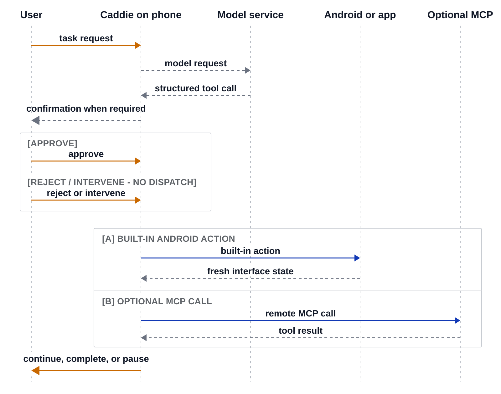

# Architecture

Caddie is phone-owned but not fully on-device: Android owns the run, while
generative inference occurs at a configured external endpoint.



```text
User
  | task, pause, correction, confirmation
  v
Caddie Android app
  |-- agent loop and run state
  |-- Accessibility observation and semantic actions
  |-- overlay and normal-mode oversight
  |-- Room persistence and recovery journal
  |-- on-device retrieval and bundled embedding model
  |-- built-in Android tools
  `-- optional MCP clients
          |
          +---- HTTPS model endpoint (generation only)
          `---- optional MCP endpoints (additional tools)
```

## Runtime ownership

The Android process owns task and session state, tool definitions, oversight
decisions, action dispatch, and recovery records. The model endpoint receives a
request and streams candidate text or tool calls; it does not own the Caddie
session. Optional MCP servers publish additional tools but likewise do not own
the agent loop.

## UI execution

The Accessibility service supplies window observations and semantic action
targets. Returned model calls pass through Android-side validation and
oversight before dispatch. Caddie observes again after actions rather than
treating a model's completion statement as ground truth.

Accessibility is a powerful trust boundary. It exposes UI text and can perform
actions in other apps. Android permission prompts and Caddie's confirmation
surfaces reduce risk but do not make arbitrary model output safe.

## Context and persistence

The app bundles a quantized multilingual E5 embedding model through Git LFS for
on-device retrieval. Generative model weights are not bundled. Runtime journals
and context databases are app-private and excluded from Android cloud backup
and device transfer. Sensitive context envelopes use an Android Keystore-backed
key where that persistence path applies.

## Repository layout

- `app/`: the complete public Android runtime and its tests;
- `docs/`: the maintained setup and system guides;
- `research/`: synthetic study fixtures, materials, and selected historical
  evaluation records, none of which runs as a product server; and
- `scripts/`: development and installation helpers.

See [Research artifacts](../research/README.md) before treating historical
evaluation data as evidence about the current Android runtime.
