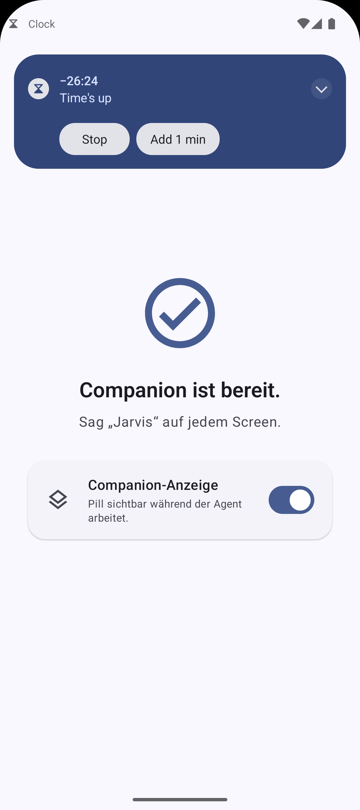
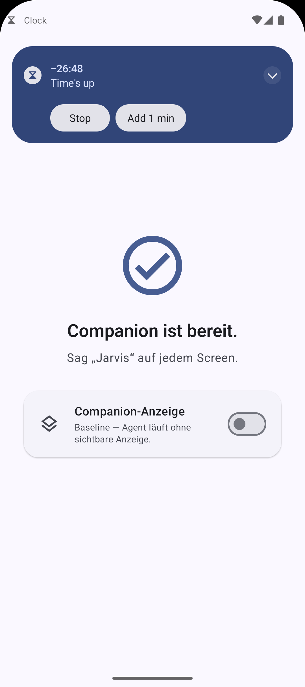

# Meeting 4 — Vorstellung

Stand 2026-05-17. Was seit Meeting 3 gebaut und am Geraet verifiziert wurde,
plus grobe Funktionsweise je Feature und vorbereitete Rueckfragen.

## Kurzfassung — was wir zeigen

1. **Failure-Mode-Studie ist durch** — 72 Trials, 6 lokale Modelle, alle per
   Screenshot verifiziert.
2. **Claude-Opus-4.7-Vergleich** — Kernbefund: die Abstraktions-Architektur
   traegt, der Flaschenhals ist das Modell, nicht die Architektur.
3. **Komplette Kontroll-/Sicherheits-Schicht gebaut** — Pause/Stop/Resume,
   knopflose Eingriff-Erkennung, Sprach-Korrektur, Swipe-to-Confirm.
4. **Architektur-Umbau** — der Agent besitzt seinen Tool-Loop jetzt selbst
   (vorher in LM Studio). Vorbedingung fuer alles oben.
5. **Baseline-Overlay-Kondition** steht.

---

## 1. Ergebnis: Failure-Mode-Studie + Claude-Vergleich

**Was:** Ein automatischer Runner faehrt 6 lokale Modelle ueber 6 Tasks x 2 Runs
(72 Trials). Jeder Trial: Outcome, Event-Trace, Screenshot. Danach jeder Trial
per Hand am Screenshot geprueft.

**Kernbefunde:**
- Das vom Modell gemeldete `done` ist **kein** Erfolgsindikator — verifizierte
  Erfolgsrate lokal nur ~10 % (7/72), obwohl ~75 % `done` gemeldet wurde.
- Claude Opus 4.7 auf denselben Tasks: **11/12** echte Erfolge (~92 %).
- → Mit einem starken Modell traegt die Skill/MCP-Abstraktionsschicht. Die
  lokalen Modelle scheitern am Modell, nicht an der Architektur.

**Wie grob:** Der Runner schickt jede Aufgabe an den Agenten, sammelt parallel
die Tool-Events und macht am Ende einen Screenshot. „Verifiziert" heisst: ein
Mensch hat den End-Screenshot mit der Aufgabe abgeglichen.

Details: `docs/failure-mode-log.md`, `docs/claude-vs-local.md`.

---

## 2. Architektur: der Agent besitzt seinen Loop selbst

**Was:** Frueher hat LM Studio den Tool-Loop server-seitig gefahren — eine
Agent-Session war ein einziger, undurchsichtiger Aufruf. Jetzt fuehrt der
Agent den Loop **Schritt fuer Schritt selbst**; LM Studio ist nur noch das
Modell (Inferenz).

**Warum das wichtig ist:** Nur so gibt es ueberhaupt einen Punkt *zwischen*
zwei Aktionen, an dem man eingreifen, pausieren oder bestaetigen kann. Ohne
diesen Umbau waere keine der folgenden Funktionen moeglich.

---

## 3. Baseline-Kondition

**Was:** Die Companion-Anzeige laesst sich per Schalter abschalten. Aus =
Baseline-Studienkondition: der Agent arbeitet identisch, nur ohne sichtbare
Begleit-UI.

**Wie grob:** Ein Settings-Flag; ist es aus, montiert der Dienst das Overlay
gar nicht erst.

---

## 4. Pause / Stop / Resume + knopflose Eingriff-Erkennung

**Was:** Der Nutzer kann einen laufenden Agenten anhalten, abbrechen oder
fortsetzen — **ohne Knopf**. Er greift einfach selbst am Handy ein (tippt
woanders hin), der Agent merkt das, friert ein, und setzt fort, sobald der
Nutzer aufhoert.

**Wie grob:** Der Begleit-Dienst sieht ohnehin alle Bildschirm-Ereignisse.
Entscheidend: die Tipp-Aktionen des Agenten laufen ueber genau diesen Dienst —
er weiss also, welche Beruehrungen *er* ausgeloest hat. Eine Beruehrung, die
waehrend eines Laufs auftritt und *nicht* vom Agenten kam, ist ein
menschlicher Eingriff → Agent pausiert. Nach ein paar Sekunden ohne weitere
Beruehrung laeuft er automatisch weiter.

**Beim Fortsetzen:** Der Agent nimmt den Bildschirm **neu wahr** (frischer
Screenshot + Hinweis „der Nutzer hat eingegriffen"), damit er nicht mit
veraltetem Wissen weiterarbeitet.

---

## 5. Mid-run-Sprach-Korrektur

**Was:** Waehrend der Agent laeuft, kann der Nutzer ihm per Sprache eine
Korrektur zurufen („nimm das andere Restaurant"). Der Agent passt sich an.

**Wie grob:** Die App hoert ohnehin dauerhaft auf das Wake-Word „Jarvis".
Laeuft gerade ein Agent, wird das Gesprochene als **Korrektur** behandelt —
als zusaetzliche Nachricht in den laufenden Dialog eingespeist — statt als
neuer Auftrag. Der Agent verarbeitet das wie eine Anweisung mitten im
Gespraech.

*(Sprach-Trigger noch nicht am Emulator getestet — braucht echtes Mikrofon.)*

---

## 6. Swipe-to-Confirm — Bestaetigung vor kritischen Aktionen

**Was:** Bevor der Agent etwas Riskantes tut (App deinstallieren, Bezahlung,
Datenverlust), haelt er an und fragt nach. Der Nutzer bestaetigt per Wisch-
Geste oder lehnt ab. Das ist TRQ3 aus dem Expose.

**Wie grob — und das ist die Frage, die der Prof stellen wird:**
Vor *jedem* Tool-Aufruf klassifiziert der Agent die Aktion auf zwei Ebenen:
- **Tool-Ebene:** ist das Werkzeug selbst zerstoererisch? (App deinstallieren/
  installieren)
- **Tap-Ebene:** zielt ein Tipp auf ein Bildschirm-Element, dessen Text ein
  Risiko-Wort traegt? („Deinstallieren", „Bezahlen", „Loeschen" …)

Trifft eins zu → der Agent fuehrt die Aktion **nicht** aus, sondern zeigt die
Wisch-Karte und wartet. Die bewusste Wisch-Geste (kein Tipp) verhindert
versehentliches Bestaetigen. Timeout = abgelehnt.

Motivation aus der Studie: ein schwaches Modell ist im Test fast versehentlich
auf einen „App deinstallieren?"-Dialog geraten — die Tap-Ebene faengt genau das.

---

## Was noch offen ist (ehrlich)

- **Selective Spotlight** (Curtain + Bounding-Box) — die technisch
  anspruchsvollste Overlay-Kondition, noch nicht gebaut. Naechster Schritt.
- **Transparent Companion** — funktioniert (die Pill), Avatar noch nicht
  visuell aufgewertet.
- **Solid Canvas** — bewusst erst nach dem Meeting.

Der Interaktions-/Sicherheits-Strang ist komplett; bei den reinen Overlay-
Konditionen steht Baseline, Spotlight fehlt noch.

---

## Moegliche Rueckfragen — vorbereitet

**„Wie wird erkannt, dass der Agent pausieren soll?"**
Der Begleit-Dienst sieht alle Bildschirm-Klicks. Die Aktionen des Agenten
laufen ueber denselben Dienst — der weiss also, was er selbst getan hat. Ein
Klick waehrend eines Laufs, den der Agent nicht ausgeloest hat = Mensch →
Pause. (Reine Klicks/Long-Klicks; ein Mensch, der nur scrollt, wird v1 noch
nicht erfasst — bewusste Grenze.)

**„Wie weiss das System, dass eine Aktion kritisch ist?"**
Klassifikation vor jedem Tool-Aufruf: destruktives Werkzeug (uninstall) ODER
ein Tipp auf ein Element mit Risiko-Wort. Schluesselwort-Liste, leicht
erweiterbar.

**„Warum habt ihr den Loop aus LM Studio herausgeholt?"**
Weil LM Studio den ganzen Ablauf als eine Black Box gefahren hat — kein
Eingriffspunkt. Mit eigenem Loop gibt es einen kontrollierten Moment zwischen
zwei Aktionen; nur dort kann man pausieren/bestaetigen.

**„Woher weiss der Agent beim Fortsetzen, was der Nutzer geaendert hat?"**
Gar nicht im Detail — er nimmt den Bildschirm beim Resume einfach neu wahr
(frischer Screenshot) statt mit altem Wissen weiterzumachen.

**„Ist die Eingriff-Erkennung zuverlaessig?"**
Fuer bewusste Taps auf Bedienelemente: ja. Grenzen: reines Scrollen wird noch
nicht erkannt; sehr schnelles Tippen genau im Moment einer Agenten-Aktion ist
unscharf. Das ist eine bewusste v1-Grenze, keine Architektur-Schwaeche.

**„Warum Wischen statt Tippen beim Bestaetigen?"**
Damit nichts versehentlich bestaetigt wird — eine gerichtete Geste ueber ~75 %
der Strecke ist absichtlich schwer aus Versehen zu machen (vgl. „slide to
unlock").

## Fragen an den Prof

1. Reicht Baseline + Companion fuers Meeting, Spotlight als „in Arbeit"?
2. Failure-Mode-Empirie + Claude-Vergleich: eigenes Kapitel oder Diskussion?
3. Mid-run-Korrektur ist jetzt umgesetzt (war als Stretch markiert) — als
   eigene Studien-Achse fuehren oder im Outlook?
4. Ethik/Datenschutz N=20: TH-Koeln-Vorlage?
