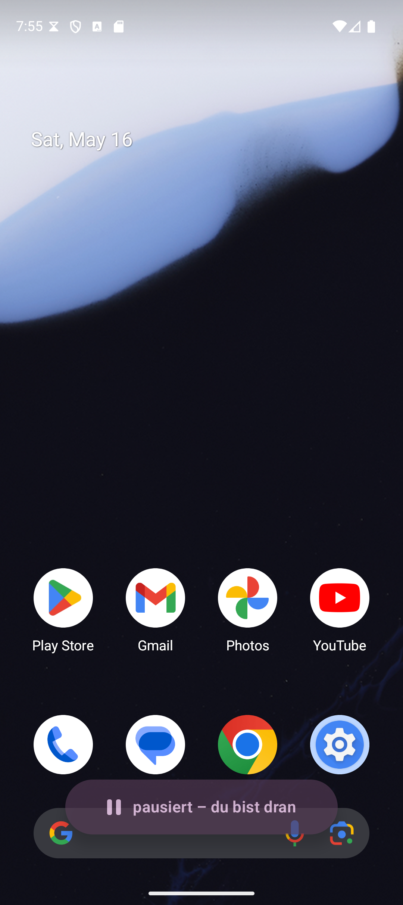
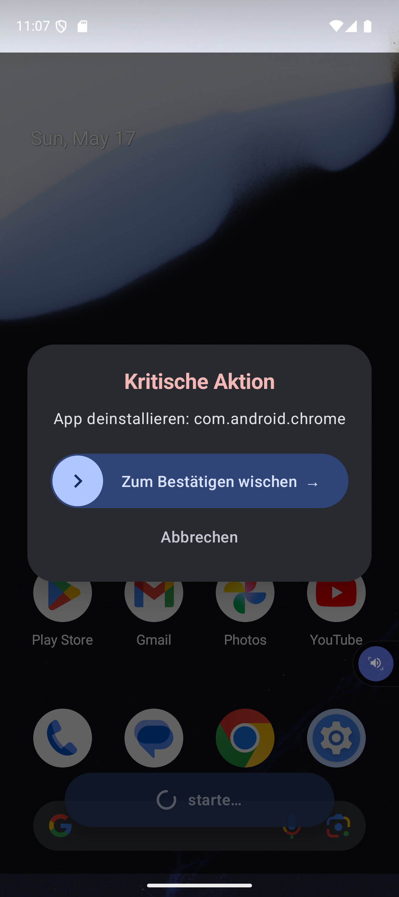

# Update nach dem Betreuergespräch - 2026-07-19

> Dieser Abschnitt bildet den aktuellen Stand ab. Die darunter stehende
> Meeting-Vorbereitung vom Mai 2026 bleibt als historischer Entwicklungsstand
> erhalten.

## Aktueller Fokus

Arbeitstitel: **Shared Autonomy - Designing User Oversight for LLM-Based
Smartphone Agents**.

Die Hauptstudie untersucht in einem Within-Subjects-Design drei Grade
verpflichtender menschlicher Aufsicht:

- **C1:** Bestätigung jeder folgenreichen Aktion,
- **C2:** ein verpflichtender finaler Checkpoint,
- **C3:** keine verpflichtende Bestätigung, aber jederzeit freiwilliger
  Eingriff.

In allen Bedingungen zeigt der Agent knapp die aktuell ausgeführte Aktion. Ein
vorheriger Ausführungsplan wird nicht als zusätzlicher Faktor verwendet. Die
Ausführung wird kontrolliert simuliert, damit Aktionen, Zeitpunkte und Fehler
zwischen den Bedingungen vergleichbar bleiben. Drei der sechs Hauptaufgaben
enthalten einen vorab definierten Fehler. Die Teilnehmenden werden nicht auf
konkrete Fehler hingewiesen, lernen aber vorab neutral, wie sie pausieren,
ändern und abbrechen können. Anschließend erfolgt ein Debriefing.

Die sechs Hauptaufgaben sind als Cross-App-Paare angelegt:

1. Chat zu Musik sowie Galerie zu Messenger,
2. E-Mail zu Kalender sowie Maps zu Messenger,
3. Chat zu Supermarkt sowie E-Mail zu einer Banking-Mock-App.

Erfasst werden Interaktionsaufwand, NASA-TLX, ausgewählte getrennt ausgewertete
TiA-Subskalen, drei eigene Manipulationscheck-Items, einmalig TAM sowie
Verhaltensmaße zur Fehlererkennung und Nebenaufgabe.

Optional wird explorativ eine zeitversetzte Agentenaktion bei ausgeschaltetem
Bildschirm untersucht. Verglichen werden **nur benachrichtigen**, **Bildschirm
aktivieren und Bestätigung einholen** sowie **Bildschirm aktivieren und
selbstständig ausführen**. Dafür sind drei gegenbalancierte Aufgaben vorgesehen:
Wetter zu Einkaufsliste, Projektgruppen-Chat zu Notizen und E-Mail zu Kalender.
Die Projektgruppen-Aufgabe ist bereits umgesetzt. Falls der Pilot eine zu lange
Gesamtdauer zeigt, wird dieser Teil in den Ausblick verschoben.

Die vollständige Spezifikation mit Forschungsfragen, Hypothesen,
Fehlerzeitpunkten, Fragebögen und Ablauf steht in
[`dossier/05-studiendesign.md`](dossier/05-studiendesign.md).

Organisatorisch ist die Buchung über Cal.com für Juli und August 2026 geplant.
Als vorläufiger Ort ist der Raum über der Mensa beziehungsweise ein Raum in der
Bibliothek vorgesehen; alternativ ist zu klären, ob noch Zugang zum MoxD-Labor
besteht.

---

# Historischer Stand der Meeting-Vorbereitung

## Titel

1. Design und Evaluation eines avatar-basierten UI-Transparenz-Paradigmas fuer
   LLM-gesteuerte Smartphone-Agenten.
2. **Vom autonomen Werkzeug zum kooperativen Partner: UI-Abstraktion und
   Nutzerkontrolle bei LLM-Smartphone-Agenten.**
3. Sichtbare Autonomie: Avatar-basierte UI-Transparenz fuer
   LLM-Smartphone-Agenten.

## Literatur-Anker (kurz)

- **MobileWorld** (ACL 2026): 201 Tasks / 20 Apps, bestes Framework nur 51.7 %,
  erste Benchmark mit „agent-user interaction" + MCP-Tasks. → Wir sitzen im
  selben Raum, aber mit HCI-Schicht obendrauf statt SOTA-Agent.
- **VLAA-GUI**: zwei Hauptfehler — *premature termination* (done ohne Beweis)
  und *unproductive loops*. → **Exakt die Failure-Modes, die wir selbst
  gemessen haben** (siehe Teil B).

## Fragen

1. **Titel**  Option 3 als Favorit bestaetigen?
2. **Failure-Mode-Empirie + Claude-Vergleich**. eigenes Kapitel oder in der
   Diskussion?
3. **Mid-run-Korrektur** .als eigene Studien-Achse fuehren oder ins Outlook?

# Teil B — Was gebaut & gemessen wurde

## 1. Failure-Mode-Studie + Claude-Vergleich (Kernbefund)

Automatischer Runner: 6 lokale Modelle × 6 Tasks × 2 Runs = **72 Trials**,
jeder per Screenshot von Hand verifiziert.

- Das vom Modell gemeldete `done` ist **kein** Erfolgsindikator: verifizierte
  Erfolgsrate lokal nur **~10 %** (7/72), obwohl ~75 % `done` meldeten.
- Claude Opus 4.7 auf denselben Tasks: **11/12** (~92 %).
- → **Mit einem starken Modell traegt die Skill/MCP-Abstraktionsschicht.** Die
  lokalen Modelle scheitern am Modell, nicht an der Architektur.

Beobachtete Failure-Modes (mappen 1:1 auf VLAA-GUI): Hallucinated Success,
Direction Confusion, Premature Termination, Unproductive Loop, Grounding Error.

Details: `docs/failure-mode-log.md`, `docs/claude-vs-local.md`.

## 2. Kontroll-/Sicherheits-Schicht

### Pause + knopflose Eingriff-Erkennung

Der Nutzer haelt einen laufenden Agenten an, **ohne Knopf**: er greift einfach
selbst am Handy ein (tippt woanders hin). Der Begleit-Dienst sieht alle
Bildschirm-Klicks  und weiss, welche *er selbst* ausgeloest hat. Ein Klick
waehrend eines Laufs, der nicht vom Agenten kam = Mensch → Pause. Nach ein
paar Sekunden Ruhe laeuft er automatisch weiter. Beim Fortsetzen nimmt der
Agent den Bildschirm **neu wahr**, statt mit altem Wissen weiterzuarbeiten.

### Swipe-to-Confirm vor kritischen Aktionen (TRQ3)

Vor jeder riskanten Aktion haelt der Agent an und fragt nach. Klassifikation
auf zwei Ebenen:

- **Tool-Ebene:** ist das Werkzeug selbst destruktiv? (App deinstallieren/
  installieren)
- **Tap-Ebene:** zielt ein Tipp auf ein Element mit Risiko-Wort?
  („Deinstallieren", „Bezahlen", „Loeschen" …)

Trifft eins zu → der Agent fuehrt **nicht** aus, sondern zeigt die Wisch-Karte.
Die bewusste Wisch-Geste (kein Tipp) verhindert versehentliches Bestaetigen,
Timeout = abgelehnt. Motivation aus der Studie: ein schwaches Modell geriet im
Test fast auf einen „App deinstallieren?"-Dialog — die Tap-Ebene faengt genau das.

## Was noch offen ist (ehrlich)

- **Baseline-Kondition** steht (Companion-Anzeige per Setup-Toggle abschaltbar;
  aus = Agent laeuft identisch, nur ohne sichtbare UI).
- **Selective Spotlight** (Curtain + Bounding-Box) — technisch
  anspruchsvollste Overlay-Kondition, noch nicht gebaut. Naechster Schritt.
- **Transparent Companion** funktioniert (Pill); Avatar visuell noch nicht
  aufgewertet.
- **Solid Canvas** — bewusst erst nach dem Meeting.

---

## Moegliche Rueckfragen — vorbereitet

**„Wie wird erkannt, dass der Agent pausieren soll?"**
Der Begleit-Dienst sieht alle Klicks; die Aktionen des Agenten laufen ueber
denselben Dienst. Ein Klick waehrend eines Laufs, den der Agent nicht
ausgeloest hat = Mensch → Pause. (Reines Scrollen wird in v1 noch nicht
erfasst — bewusste Grenze.)

**„Wie weiss das System, dass eine Aktion kritisch ist?"**
Klassifikation vor jedem Tool-Aufruf: destruktives Werkzeug ODER ein Tipp auf
ein Element mit Risiko-Wort. Schluesselwort-Liste, leicht erweiterbar.

**„Warum den Loop aus LM Studio herausgeholt?"**
LM Studio fuhr den Ablauf als Black Box — kein Eingriffspunkt. Eigener Loop =
kontrollierter Moment zwischen zwei Aktionen; nur dort kann man pausieren/
bestaetigen.

**„Woher weiss der Agent beim Fortsetzen, was sich geaendert hat?"**
Gar nicht im Detail — er nimmt den Bildschirm beim Resume neu wahr.

**„Warum Wischen statt Tippen beim Bestaetigen?"**
Eine gerichtete Geste ist absichtlich schwer aus Versehen zu machen
(vgl. „slide to unlock").
